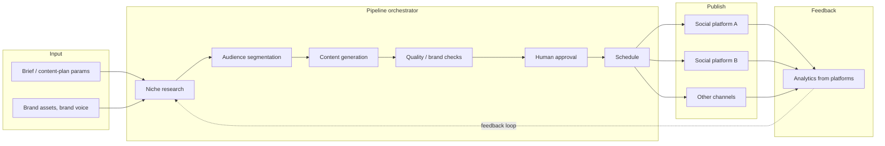
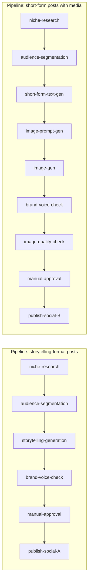

[Русский](./README.ru.md) · **English**

# Content Generation Pipeline

A self-hosted multimodal content generation platform with pipeline
orchestration, support for manual and automatic steps, human-in-the-loop,
and publishing to channels.

> **Disclaimer.** This is a public architectural description of a real
> system the author worked on. Specific clients, domain names, financial
> indicators, source code, and proprietary implementation details are
> not disclosed. The content is limited to architectural decisions and
> principles publicly discussed for systems of this kind.

## What the system does

The platform takes content-plan requirements as input (niche, audience,
channels, frequency, tone) and produces ready-to-publish content:

- **Niche analytics** — competitor research, topic clusters, current
  trends.
- **Audience segmentation** — building personas for different
  positioning hypotheses.
- **Content generation** — copy, headlines, multimodal bundles
  (text + image).
- **Validation** — automatic (length, forbidden phrasings, brand voice)
  and manual (human-in-the-loop approval).
- **Auto-posting** — publishing to social platforms on schedule or by
  trigger.
- **Result analytics** — feedback from platforms to adjust strategy.

The system is multi-project: a single deployment hosting multiple
content directions, each with its own settings, brand guidelines, and
pipelines.

## Business value

Marketing and content teams live under constant tension: there's more
content to produce than capacity to write, and quality drifts as soon
as throughput goes up. Scaling means more headcount (expensive, slow
onboarding), outsourcing (loses brand voice), or cutting output
(loses reach). Plain LLMs solve throughput but introduce generic,
off-brand text that needs heavy editing anyway.

The platform splits production into composable, configurable pipeline
stages: niche research, audience segmentation, generation, brand-voice
check, length and compliance validation, manual approval, multi-channel
publication. The stage registry is open — a new stage type is a
handler module with Pydantic input/output contracts, no core changes.
The in-UI builder lets a product owner assemble new content scenarios
without engineering. Human-in-the-loop approval is a first-class stage
type, not a side process: drafts can be edited or rejected inline, the
system tracks edits, and prompt and scenario quality compounds over
time.

Net effect: a brand-controlled content factory where humans set
strategy and approve, agents do the volume work, throughput scales
without proportional headcount growth, and brand consistency holds as
the team adds new channels and campaign types.

## My role

A solo project: I was the only person who took the system from idea to
working platform.

- **Product**: value proposition, MVP scope, iterations with users.
- **Architecture**: DB schema, layer boundaries, contracts between
  layers.
- **Backend**: API, stage registry, pipeline run orchestrator,
  approval service, publication scheduler, external platform adapters.
- **Frontend**: SPA with a pipeline builder (drag & drop), project and
  media-asset pages, approval queue with an inline editor.
- **Operations**: build, deploy, monitoring, backups.

## Stack

| Layer | Technologies |
|---|---|
| **Backend** | Python 3.12, FastAPI, async SQLAlchemy 2.x, Alembic, Pydantic v2 |
| **Queues** | Celery 5.x + Redis 7 |
| **DB** | PostgreSQL 16 |
| **Frontend** | React 18, TypeScript, Vite, TailwindCSS, Lucide Icons |
| **LLM** | OpenAI-compatible providers (via abstraction layer) |
| **Auth** | JWT (HS256), bcrypt for passwords, Fernet for DB secret encryption |
| **File storage** | local mount or S3-compatible (via adapter) |
| **CI** | GitLab CI |

## High-level architecture

### Data flow

A more detailed component and layered architecture is in
[`docs/architecture.md`](docs/architecture.md).

## Pipeline — model and stages

Each pipeline is a **sequence of stages**. Stages are **reusable
components**: the same `niche-research` stage can be used in different
pipelines with different configurations.

### Stage properties

Each stage is a separate module with:

- **Input contract** — Pydantic model describing what the stage takes.
- **Output contract** — Pydantic model describing what the stage
  produces.
- **Configuration** — stage parameters (prompt template, LLM model,
  length limits, etc.).
- **Execution** — async function or Celery task that does the work.

Data is passed between stages via a serialized JSON-context that
accumulates as the pipeline progresses.

### Stage types

| Type | What it does | Example |
|---|---|---|
| **Research** | Collecting and processing external information | niche-research, competitor-analysis |
| **Segmentation** | Grouping / partitioning | audience-segmentation, topic-clustering |
| **Generation** | Creating content (text, image) | storytelling-gen, image-gen, headline-gen |
| **Validation** | Compliance checks | length-check, brand-voice-check, profanity-filter |
| **Human gate** | Stopping for a manual action | manual-approval, manual-edit |
| **Action** | External effect | publish-to-channel, send-notification |

### Execution states

The stage state-machine
(Pending → Running → Completed / Failed / AwaitingApproval → Approved / Edited / Rejected)
is described in [`docs/architecture.md`](docs/architecture.md).

## Human-in-the-Loop

A core feature: a pipeline can be paused at the **manual-approval** or
**manual-edit** stage, and the user must explicitly approve / edit
the result before the pipeline continues. In the UI this is the
**approval queue** — a list of «frozen» pipelines waiting for a human.
The user sees the generated content next to brand guidelines and
previous checks; they can approve, edit, or reject. Details — ADR-003
in [`docs/decisions.md`](docs/decisions.md).

## Builder, multi-tenancy, integrations

- **In-UI pipeline builder**: users assemble scenarios from stage
  components themselves, without code. Details — ADR-002.
- **Multi-tenancy**: a single deployment, multiple projects with
  isolated data, brand profiles, AI configs, and integrations.
- **Social platform adapters**: a single interface with implementations
  per platform. Credentials are stored in the DB, encrypted with Fernet
  (see ADR-005).

## Key architectural decisions

A detailed walkthrough is in [`docs/decisions.md`](docs/decisions.md).
Summary:

1. **Stages as reusable components** — different pipelines are
   assembled by combining the same stages with different
   configurations.
2. **In-UI pipeline builder** — users assemble scenarios themselves
   without developer involvement.
3. **Human-in-the-loop as a first-class stage** — manual-approval /
   manual-edit are part of the pipeline state-machine, not a
   side-channel.
4. **Pipeline state in PostgreSQL** — single observation point,
   transactional consistency between business data and processing
   state.
5. **Credential encryption via Fernet** — LLM provider API keys and
   social platform tokens are encrypted at the ORM layer.
6. **Multi-channel publication schedule** — Celery beat + DB schedule
   table; a post can be scheduled for different platforms at different
   times.

## What this project demonstrates

The core idea: shift the product from a «fixed application» category
to a **builder platform** category — users assemble scenarios from
reusable blocks themselves, without developer involvement.

- **Composability as a product**: stage plugins + registry + UI builder
  = users add new generation scenarios without PRs.
- **HITL as a first-class entity**: manual steps are stage types with
  their own transitions in the state-machine, not a separate subsystem
  beside the pipeline.
- **Heterogeneous external integrations under one interface**: social
  platforms with all their specific API quirks are hidden behind a
  thin adapter.
- **Solo full-stack ownership**: product decisions, architecture,
  backend, frontend, operations — without responsibility splits and
  communication losses.

## Additional documentation

- [`docs/architecture.md`](docs/architecture.md) — extended
  architectural description
- [`docs/decisions.md`](docs/decisions.md) — ADR-style walkthrough of
  key decisions
