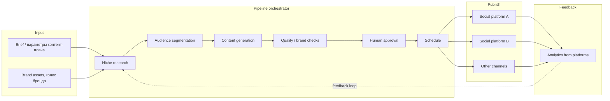
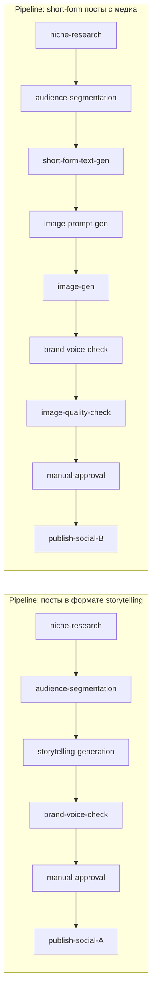

**Русский** · [English](./README.md)

# Content Generation Pipeline

Self-hosted платформа мультимодальной генерации контента с оркестрацией пайплайнов, поддержкой ручных и автоматических шагов, человеком в петле (human-in-the-loop) и публикацией в каналы.

> **Дисклеймер.** Это публичное описание архитектуры реальной системы, в разработке которой автор участвовал. Конкретные клиенты, доменные имена, финансовые показатели, исходный код и проприетарные детали реализации не раскрываются. Содержание ограничено архитектурными решениями и принципами, обсуждаемыми в публичном поле для систем такого назначения.

## Что делает система

Платформа берёт на вход требования к контент-плану (ниша, аудитория, каналы, частота, тональность) и продуцирует готовый к публикации контент:

- **Аналитика ниши** — изучение конкурентов, тематических кластеров, актуальных тем.
- **Сегментирование аудитории** — формирование портретов для разных гипотез позиционирования.
- **Генерация контента** — тексты, заголовки, мультимодальные сборки (текст + изображение).
- **Проверка** — автоматическая (длина, запрещённые формулировки, brand voice) и ручная (human-in-the-loop approval).
- **Автопостинг** — публикация в социальные платформы по расписанию или по триггеру.
- **Аналитика результатов** — обратная связь от платформ для коррекции стратегии.

Система мульти-проектная: один контур, несколько контент-направлений, каждое со своими настройками, brand-гайдлайнами и пайплайнами.

## Польза для бизнеса

Маркетинг и контент-команды живут в постоянном противоречии: контента надо больше, чем есть мощности на написание, а с ростом throughput'а падает качество. Растить штат — дорого и долго онбордить, аутсорсить — теряется brand voice, урезать объём — теряется охват. Голые LLM закрывают throughput, но дают generic-тексты вне бренда, которые всё равно требуют тяжёлой редактуры.

Платформа разбивает производство на композируемые конфигурируемые стадии: niche research, сегментация аудитории, генерация, brand-voice check, проверка длины и compliance, ручная аппрувка, многоканальная публикация. Реестр стадий открыт — новый тип стадии = handler-модуль с Pydantic input/output контрактами, ядро не трогается. UI-конструктор позволяет product owner'у собирать новые сценарии контента без инженеров. Human-in-the-loop approval — полноценный тип стадии, а не сторонний процесс: черновики правятся или отклоняются прямо в UI, система фиксирует правки, качество промптов и сценариев со временем растёт.

Чистый эффект: контент-фабрика с контролем бренда, где люди задают стратегию и согласуют результаты, агенты делают объём, throughput масштабируется без пропорционального роста штата, консистентность бренда сохраняется при добавлении новых каналов и типов кампаний.

## Моя роль в проекте

Соло-проект: я единственный человек, который вёл систему от идеи до работающей платформы.

- **Продукт**: формулировка ценности, скоуп MVP, итерации с пользователями.
- **Архитектура**: схема БД, граница слоёв, контракты между ними.
- **Backend**: API, регистр стадий, оркестратор запусков пайплайнов, approval-сервис, scheduler публикаций, адаптеры внешних платформ.
- **Frontend**: SPA с конструктором пайплайнов (drag & drop), страницы проектов и медиа-assets, очередь approval с инлайн-редактором.
- **Эксплуатация**: build, deploy, мониторинг, бэкапы.

## Стек

| Слой | Технологии |
|---|---|
| **Backend** | Python 3.12, FastAPI, async SQLAlchemy 2.x, Alembic, Pydantic v2 |
| **Очереди** | Celery 5.x + Redis 7 |
| **БД** | PostgreSQL 16 |
| **Frontend** | React 18, TypeScript, Vite, TailwindCSS, Lucide Icons |
| **LLM** | OpenAI-совместимые провайдеры (через провайдер-абстракцию) |
| **Авторизация** | JWT (HS256), bcrypt для паролей, Fernet для шифрования секретов в БД |
| **Файловое хранилище** | локальный mount или S3-совместимое (через адаптер) |
| **CI** | GitLab CI |

## Архитектура — high-level

### Поток данных

Подробная компонентная и слоистая архитектура — в [`docs/architecture.ru.md`](docs/architecture.ru.md).

## Pipeline — модель и стадии

Каждый пайплайн — это **последовательность стадий**. Стадии — **переиспользуемые компоненты**: одна и та же стадия `niche-research` может быть использована в разных пайплайнах с разной конфигурацией.

### Свойства стадии

Каждая стадия — отдельный модуль с:

- **Input contract** — Pydantic-модель того, что стадия принимает на вход.
- **Output contract** — Pydantic-модель того, что стадия даёт на выход.
- **Configuration** — параметры стадии (промт-шаблон, модель LLM, ограничения по длине, и т.п.).
- **Execution** — async-функция или Celery-таск, который делает работу.

Передача данных между стадиями — через сериализованный JSON-context, который накапливается по мере прохождения пайплайна.

### Базовые типы стадий

| Тип | Что делает | Пример |
|---|---|---|
| **Research** | Сбор и обработка внешней информации | niche-research, competitor-analysis |
| **Segmentation** | Группировка / разбиение | audience-segmentation, topic-clustering |
| **Generation** | Создание контента (текст, изображение) | storytelling-gen, image-gen, headline-gen |
| **Validation** | Проверка соответствия правилам | length-check, brand-voice-check, profanity-filter |
| **Human gate** | Остановка для ручного действия | manual-approval, manual-edit |
| **Action** | Внешний эффект | publish-to-channel, send-notification |

### Состояния выполнения

State-machine стадий (Pending → Running → Completed / Failed / AwaitingApproval → Approved / Edited / Rejected) описан в [`docs/architecture.ru.md`](docs/architecture.ru.md).

## Human-in-the-Loop

Ключевая фича: пайплайн может быть остановлен на стадии **manual-approval** или **manual-edit**, и пользователь должен явно одобрить / отредактировать результат, прежде чем пайплайн продолжится. В UI это **очередь approval'ов** — список «застывших» pipeline'ов, ждущих человека. Пользователь видит сгенерированный контент рядом с brand-гайдлайнами и предыдущими проверками; может одобрить, отредактировать или отклонить. Подробно — ADR-003 в [`docs/decisions.ru.md`](docs/decisions.ru.md).

## Конструктор, multi-tenancy, интеграции

- **Конструктор пайплайнов в UI**: пользователь сам собирает сценарии из стадий-компонентов, без кода. Подробно — ADR-002.
- **Multi-tenancy**: один контур, несколько проектов с изолированными данными, brand-профилями, AI-конфигами и интеграциями.
- **Адаптеры социальных платформ**: единый интерфейс с реализациями под разные платформы. Credentials хранятся в БД, шифруются Fernet (см. ADR-005).

## Ключевые архитектурные решения

Подробный разбор каждого решения — в [`docs/decisions.ru.md`](docs/decisions.ru.md). Краткий список:

1. **Стадии как переиспользуемые компоненты** — разные пайплайны собираются комбинацией одних и тех же стадий с разной конфигурацией.
2. **Конструктор пайплайнов в UI** — пользователь сам собирает сценарий без вмешательства разработчика.
3. **Human-in-the-loop как полноценная стадия** — manual-approval / manual-edit встроены в pipeline-state-machine, не как side-channel.
4. **Pipeline state в PostgreSQL** — одна точка наблюдения, transactional consistency между бизнес-данными и состоянием обработки.
5. **Шифрование credentials через Fernet** — API-ключи LLM-провайдеров и токены социальных платформ зашифрованы на уровне ORM.
6. **Многоканальное расписание публикаций** — Celery beat + БД-таблица расписаний; пост может быть запланирован на разные платформы с разным временем.

## Что демонстрирует этот проект

Ключевая идея проекта — сместить продукт из категории «фиксированное приложение» в категорию **платформы-конструктора**: пользователь сам собирает сценарий из переиспользуемых блоков, без участия разработчика.

- **Композиционность как продукт**: стадии-плагины + регистр + UI-конструктор = пользователь добавляет новые сценарии генерации без PR'ов.
- **HITL как первоклассная сущность**: ручные шаги — это типы стадий с собственными переходами в state-machine, а не отдельная подсистема рядом с pipeline'ом.
- **Гетерогенность внешних интеграций под одним интерфейсом**: социальные платформы со всеми своими специфическими API-причудами скрыты за тонким адаптером.
- **Соло-владение полным стеком**: продакт-решение, архитектура, backend, frontend, эксплуатация — без разделения ответственности и потерь на коммуникации.

## Дополнительная документация

- [`docs/architecture.ru.md`](docs/architecture.ru.md) — расширенное архитектурное описание
- [`docs/decisions.ru.md`](docs/decisions.ru.md) — ADR-style разбор ключевых решений

