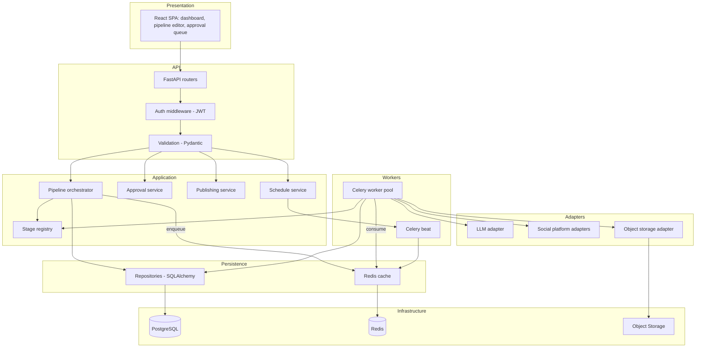
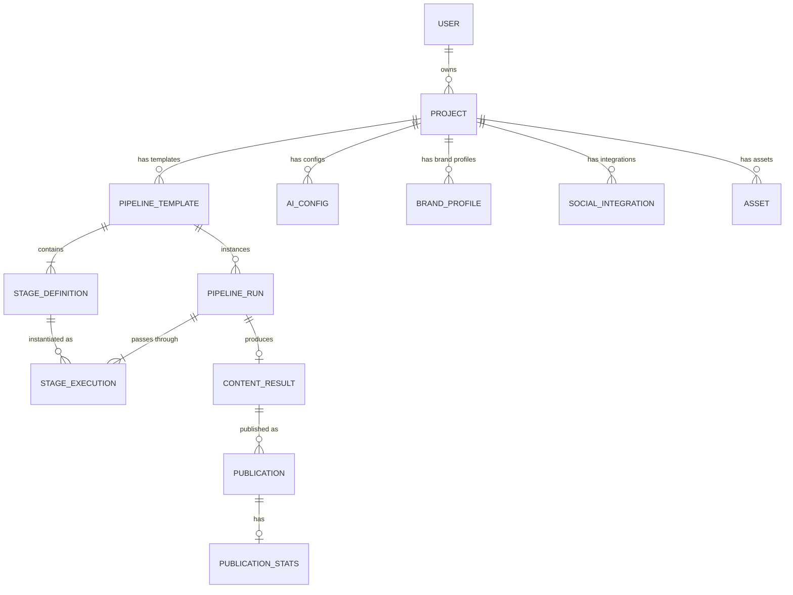
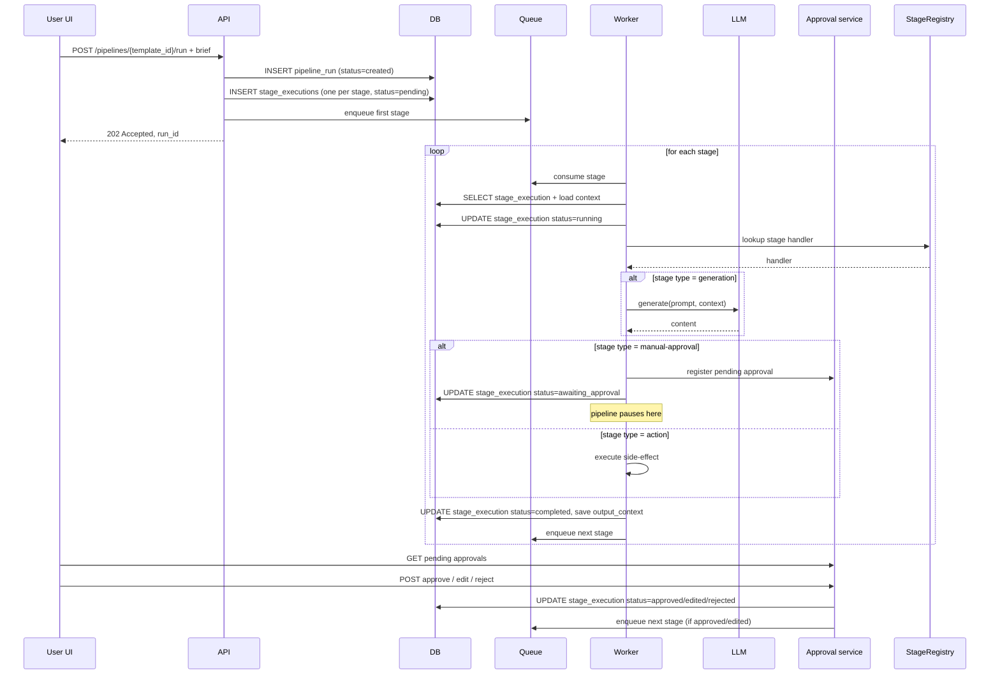
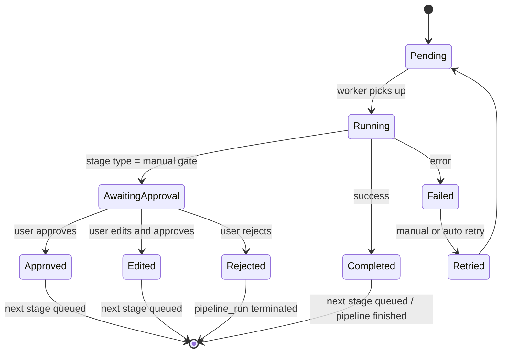
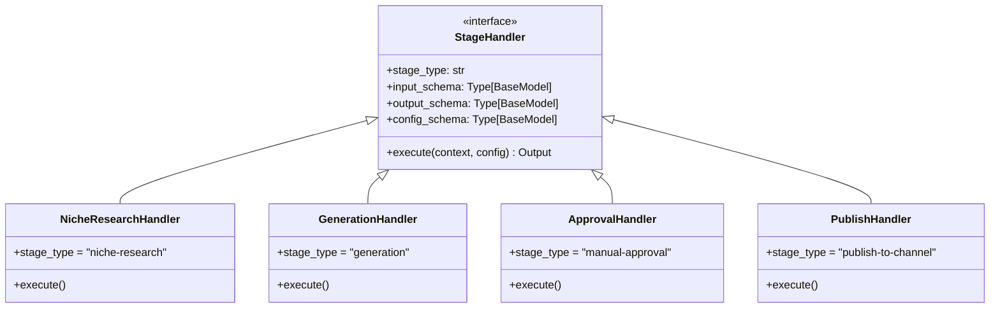
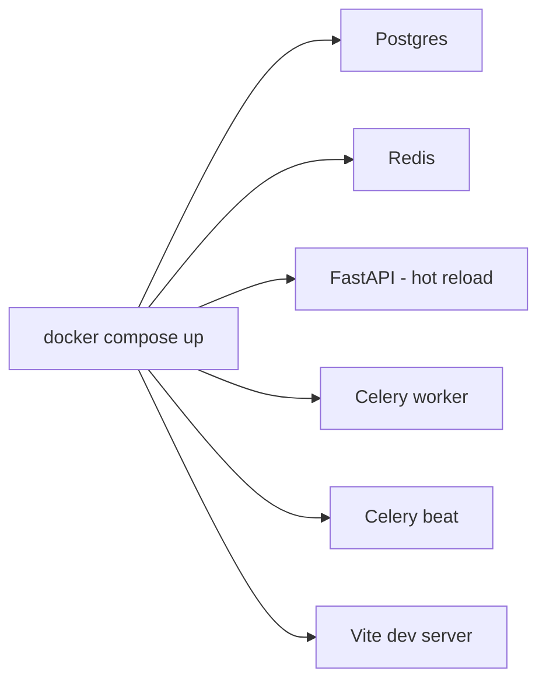
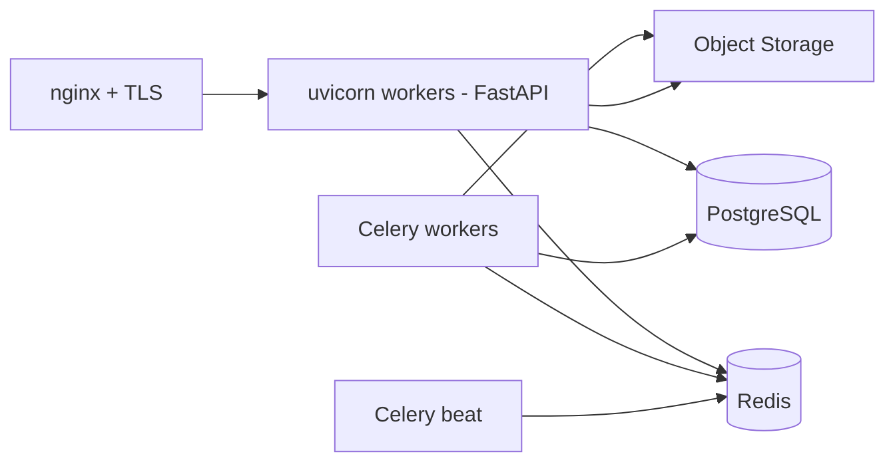

[Русский](./architecture.ru.md) · **English**

# Architecture — Content Generation Pipeline

> **Disclaimer.** This is a public architectural description of a real
> system the author worked on. Specific clients, domain names,
> financial indicators, source code, and proprietary implementation
> details are not disclosed. The content is limited to architectural
> decisions and principles publicly discussed for systems of this kind.

Extended architectural description. Companion to [README.md](../README.md).

## 1. System layers

## 2. Domain model

High-level entities and relations. Three semantic clusters can be
distinguished:

- **Project configuration** — what the user configures: brand profiles,
  AI configs, platform integrations, media assets, pipeline templates.
- **Execution** — a concrete pipeline run and its stages.
- **Result** — generated content and its publications with analytics.

### Entity purposes

- **USER / PROJECT** — account and isolated working context.
- **BRAND_PROFILE** — brand voice, visual guidelines (used by validator
  stages).
- **AI_CONFIG** — LLM provider credentials and parameters for the
  project. Sensitive fields are encrypted.
- **SOCIAL_INTEGRATION** — credentials and configuration for a specific
  social platform. Sensitive fields are encrypted.
- **ASSET** — media files available to pipeline stages (logos,
  templates, photos).
- **PIPELINE_TEMPLATE / STAGE_DEFINITION** — user-built pipeline
  template and a description of its stages with configuration.
- **PIPELINE_RUN** — a single run of a template against a specific
  brief.
- **STAGE_EXECUTION** — execution of a single stage within a run;
  stores input and output context for traceability.
- **CONTENT_RESULT** — the final generation result.
- **PUBLICATION / PUBLICATION_STATS** — publication of a result to a
  specific channel and metrics from there.

## 3. Pipeline-run lifecycle

## 4. Pipeline state machine — detailed

Each `STAGE_EXECUTION` goes through these states:

Each transition is a separate DB transaction, providing atomicity and
visibility in the UI.

## 5. Stage registry — extensibility

Stages register in the registry at app startup. The registry is a
dictionary `{stage_type: handler_class}`. To add a new stage:

1. Define input / output contracts (Pydantic models).
2. Implement a handler class with
   `async def execute(context, config) -> output`.
3. Register in the registry via decorator or explicit call.

After that the stage is available in the in-UI pipeline builder — the
user can select and configure it.

## 6. Security

### Authentication and sessions

- Session tokens are JWT with HMAC signing (HS256). Short-lived access
  token, refresh token in an HttpOnly cookie.
- User passwords in the DB are stored as bcrypt hashes only.

### Sensitive data

The system has three classes of sensitive information that need
protection from leakage:

- LLM keys (billing surface)
- OAuth tokens / API credentials of social platforms (access to the
  customer's corporate accounts)
- Object-storage access keys

All these fields are encrypted at the ORM layer (Fernet) and stored in
the DB already encrypted. The encryption key is held in the server's
env config. Any tool reading the DB directly — backup, dump,
log-collector, dba session — sees only ciphertext.

### Project isolation

In the UI a user only sees data from projects they have access to.
Queries are filtered by `project_id` at the repository layer.

### Audit log

A separate table records user actions on key entities: authentication,
project config changes, operations on pipeline runs, approval actions,
publications. The set is extended as new compliance requirements
emerge.

## 7. Deployment

### Dev — Docker Compose

### Production

The target installation is a single-server Linux. Backend runs under
uvicorn workers behind a reverse proxy (nginx) with TLS termination;
Celery workers and the beat scheduler are separate processes;
everything is managed by a process supervisor.

The frontend static bundle is served by nginx. All service processes
(backend, workers, beat) are run by a process supervisor and write
structured logs to the system journal.

### CI

GitLab CI with typical stages for a Python + JS stack:

- **Lint**: static code checks (ruff / black / mypy for Python; eslint
  for frontend).
- **Test**: pytest with PG and Redis running in the CI runner. Unit
  and integration.
- **Build**: frontend bundle and backend wheel.
- **Artifact**: packaged release.

Release rollout to the target server is a short sequence of pull,
dependency installation, frontend build, DB migration, and service
restart.

## 8. Monitoring and observability

- **Structured logs** in JSON, with the aggregator on the installation
  side.
- **Health endpoints**: `/health` (liveness), `/health/deps`
  (readiness — PG, Redis, Storage check).
- **Pipeline metrics**: number of runs by status, average pass-through
  time, error rate per stage.
- **Publishing metrics**: publishing success rate per platform,
  latency.
- **Audit log** in the DB.
