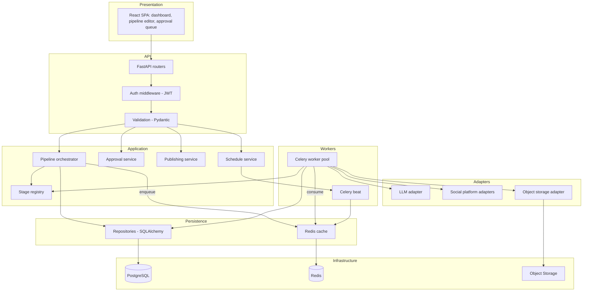
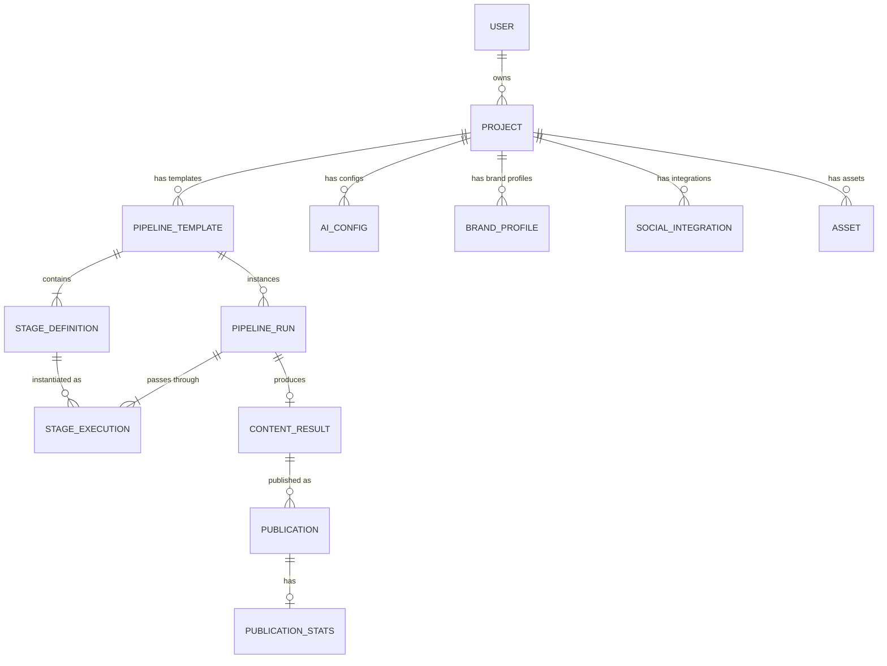
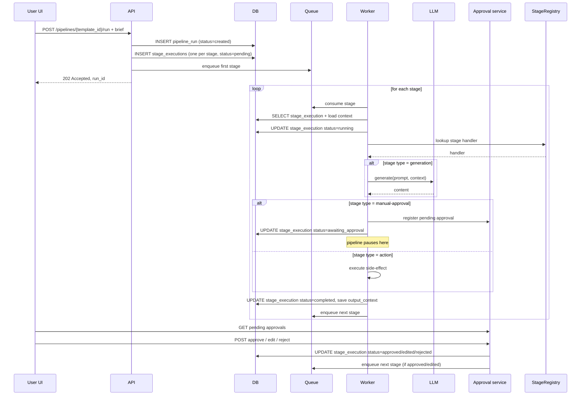
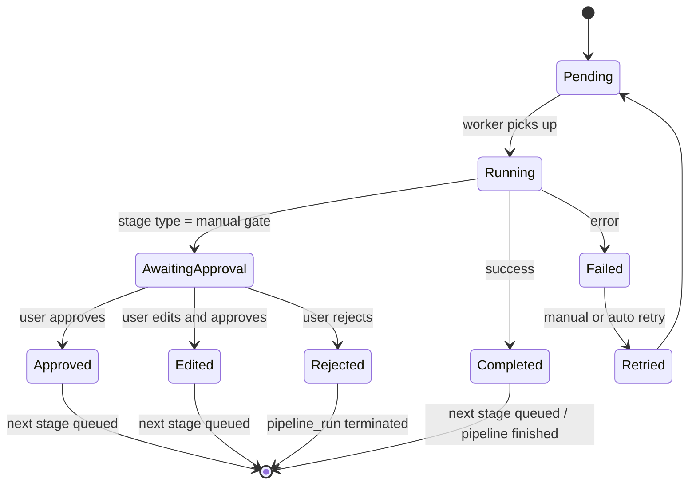
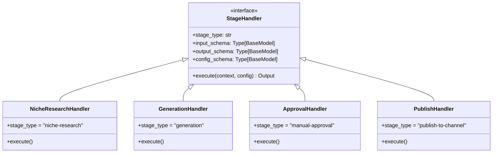
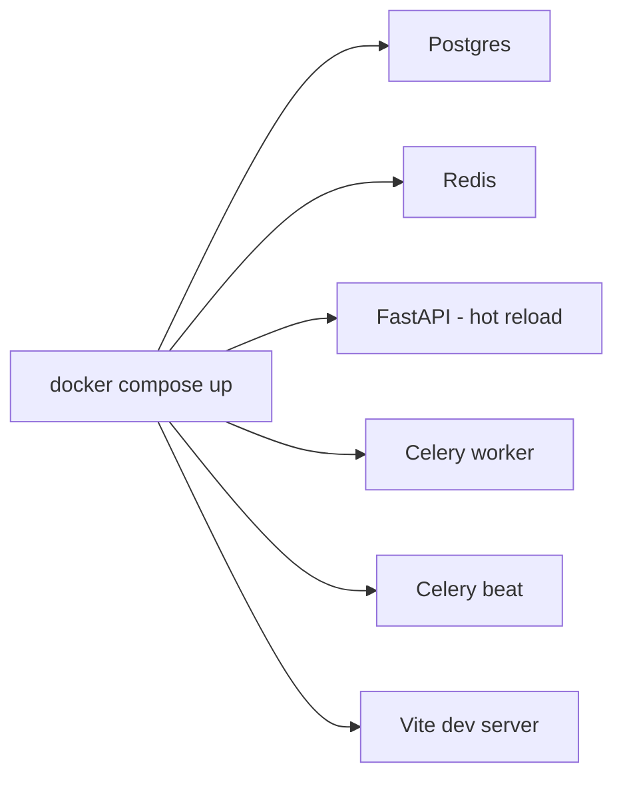
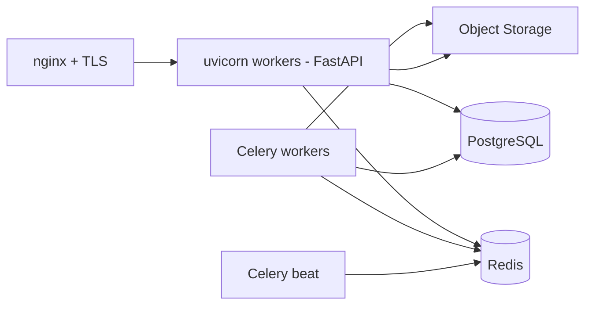

**Русский** · [English](./architecture.md)

# Architecture — Content Generation Pipeline

> **Дисклеймер.** Это публичное описание архитектуры реальной системы, в разработке которой автор участвовал. Конкретные клиенты, доменные имена, финансовые показатели, исходный код и проприетарные детали реализации не раскрываются. Содержание ограничено архитектурными решениями и принципами, обсуждаемыми в публичном поле для систем такого назначения.

Расширенное архитектурное описание. Дополняет [README.md](../README.md).

## 1. Слои системы

## 2. Доменная модель

Высокоуровневые сущности и связи. Можно выделить три семантических кластера:

- **Конфигурация проекта** — то, что пользователь настраивает: brand-профили, AI-конфиги, интеграции с платформами, медиа-assets, шаблоны пайплайнов.
- **Исполнение** — конкретный запуск пайплайна и его стадии.
- **Результат** — сгенерированный контент и его публикации с аналитикой.

### Назначение сущностей

- **USER / PROJECT** — учётка и изолированный контекст работы.
- **BRAND_PROFILE** — голос бренда, визуальные гайдлайны (используется стадиями-валидаторами).
- **AI_CONFIG** — credentials и параметры LLM-провайдеров для проекта. Чувствительные поля шифруются.
- **SOCIAL_INTEGRATION** — credentials и конфигурация для конкретной социальной платформы. Чувствительные поля шифруются.
- **ASSET** — медиа-файлы, доступные стадиям пайплайна (логотипы, шаблоны, фото).
- **PIPELINE_TEMPLATE / STAGE_DEFINITION** — пользовательский шаблон пайплайна и описание его стадий с конфигурацией.
- **PIPELINE_RUN** — единичный запуск шаблона на конкретном брифе.
- **STAGE_EXECUTION** — выполнение одной стадии в рамках run'а; хранит входной и выходной контекст для трассируемости.
- **CONTENT_RESULT** — финальный результат генерации.
- **PUBLICATION / PUBLICATION_STATS** — публикация результата в конкретный канал и метрики оттуда.

## 3. Жизненный цикл pipeline-run

## 4. Pipeline state machine — детально

Каждый `STAGE_EXECUTION` проходит через состояния:

Каждый переход — отдельная транзакция в БД, что обеспечивает atomicity и видимость в UI.

## 5. Stage registry — расширяемость

Стадии регистрируются в реестре при старте приложения. Реестр — словарь `{stage_type: handler_class}`. Добавить новую стадию:

1. Описать input / output контракты (Pydantic-модели).
2. Реализовать handler-класс с методом `async def execute(context, config) -> output`.
3. Зарегистрировать в реестре через декоратор или явный вызов.

После этого стадия доступна в конструкторе пайплайнов в UI — пользователь может её выбрать и сконфигурировать.

## 6. Безопасность

### Аутентификация и сессии

- Сессионные токены — JWT с HMAC-подписью (HS256). Access-токен короткоживущий, refresh — в HttpOnly-cookie.
- Пароли пользователей в БД — только хеши через bcrypt.

### Чувствительные данные

В системе три класса чувствительной информации, которые требуют защиты от утечки:

- LLM-ключи (биллинговая поверхность)
- OAuth-токены / API-credentials социальных платформ (доступ к корпоративным аккаунтам клиента)
- Ключи доступа к медиа-хранилищам

Все эти поля шифруются на уровне ORM (Fernet) и хранятся в БД уже зашифрованными. Encryption key держится в env-конфигурации сервера. Любой инструмент, читающий БД напрямую — бэкап, дамп, log-collector, dba-сессия — видит только шифр.

### Изоляция проектов

В UI пользователь видит только данные тех проектов, на которые у него есть доступ. Запросы фильтруются по `project_id` на уровне репозиториев.

### Audit log

В отдельной таблице фиксируются пользовательские действия с ключевыми сущностями: аутентификация, изменение конфигурации проекта, операции над pipeline-runами, approval-действия, публикации. Состав расширяется по мере появления новых требований compliance.

## 7. Деплой

### Dev — Docker Compose

### Production

Целевая инсталляция — single-server Linux. Backend под uvicorn-воркерами за reverse-proxy (nginx) с TLS-терминацией; Celery-воркеры и beat-планировщик — отдельные процессы; всё под управлением process-supervisor.

Static-bundle фронтенда раздаётся nginx'ом. Все служебные процессы (backend, workers, beat) поднимаются process-supervisor'ом и пишут структурированные логи в системный журналер.

### CI

GitLab CI с типичными этапами для Python+JS-стека:

- **Lint**: статические проверки кода (ruff / black / mypy для Python; eslint для frontend).
- **Test**: pytest с поднятыми PG и Redis в CI-runner. Юнит и интеграционные.
- **Build**: frontend-bundle и backend-wheel.
- **Artifact**: упакованный релиз.

Раскатка релиза на целевой сервер — короткая последовательность из pull, установки зависимостей, сборки фронта, миграции БД и перезапуска сервисов.

## 8. Мониторинг и observability

- **Структурированные логи** в JSON, агрегатор на стороне инсталляции.
- **Health endpoints**: `/health` (liveness), `/health/deps` (readiness — проверка PG, Redis, Storage).
- **Метрики pipeline**: количество run'ов по статусам, среднее время прохождения, error rate по стадиям.
- **Метрики publishing**: успешность публикации по платформам, latency.
- **Audit log** в БД.

